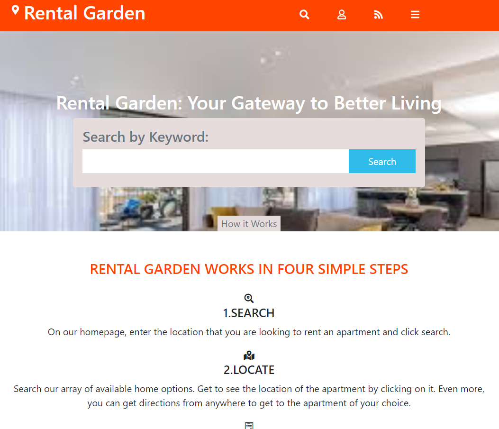

# Project Name
HTML Capstone: Directory of Available Apartments

This project is simular in structure to the patashule website. It is a site that allows individuals to search, locate, and apply for apartments.

This project is responsive and has 3 versions: mobile, tablet and desktop.

## Built With

- HTML
- SCSS
- Bootstrap

## Live Demo

[Live Demo Link](http://raw.githack.com/Tasheka/Capstone-Directory-of-Available-Apartments/directory/index.html)

## Original Design

The original design can be found at https://www.behance.net/gallery/25563385/PatashuleKE. Designed by: Mathew Njuguna and Sam Achola.

## Authors

👤 Tasheka Hamilton

- GitHub: [@Tasheka](https://github.com/Tasheka)
- LinkedIn: [LinkedIn](https://www.linkedin.com/in/tasheka-hamilton-43532311b/)

## 🤝 Contributing

Contributions, issues, and feature requests are welcome!

Feel free to check the [issues page](https://github.com/Tasheka/Capstone-Directory-of-Available-Apartments/issues).

## Show your support

Give a ⭐️ if you like this project!

## 📝 License

This project is [MIT](lic.url) licensed.
